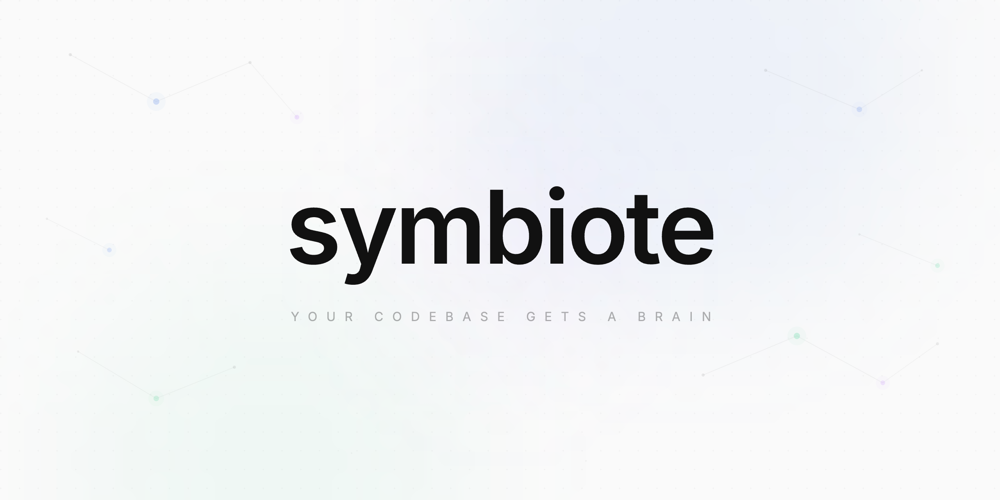

<div align="center">



# Symbiote

**Your AI forgets. Symbiote remembers.**

Bonds with your AI coding tools, giving them a brain that understands your project
and a DNA that carries your style. One command. Every session. Zero cold start.

_A symbiont is an organism that lives in close association with another. Symbiote bonds with your AI tools — giving them memory, context, and your coding DNA._

[](https://www.npmjs.com/package/symbiote-cli)
[](LICENSE)
[](https://www.typescriptlang.org/)
[](https://modelcontextprotocol.io/)

</div>

---

## The Problem

Every AI coding session starts from scratch. The AI doesn't know your architecture, ignores your conventions, and repeats the same mistakes you corrected yesterday. Static rule files are manual and fragile. Every new conversation is a cold start.

**Your corrections vanish. Your preferences reset. Your AI has amnesia.**

## Why Not Just CLAUDE.md?

CLAUDE.md is great for explicit instructions — but it's static text you maintain by hand. Symbiote is a living knowledge graph that updates itself every time your codebase changes.

|                           | CLAUDE.md                         | Symbiote                                         |
| ------------------------- | --------------------------------- | ------------------------------------------------ |
| **Project structure**     | You write and maintain it         | Auto-scanned, always current                     |
| **Dependencies & impact** | Not possible                      | Full graph — "what breaks if I change this?"     |
| **File connections**      | You document them manually        | Every import, call, and edge mapped              |
| **Coding style**          | You write rules once              | Learns from corrections, carries across projects |
| **Stays current**         | Only if you remember to update it | Re-indexes on every change                       |

They're complementary. Use CLAUDE.md for explicit instructions your AI should always follow. Use Symbiote for the deep project understanding no static file can provide.

## How Symbiote Fixes This

```bash
npx symbiote init
```

Symbiote scans your codebase, builds a living knowledge graph, detects your AI tools, and bonds with them — all in one command. From that point on, your AI knows your project's architecture, respects your constraints, and writes code in your style.

```
  Scanning codebase...
  ◇ 142 files · 891 nodes · 1,204 edges

  Analyzing project...
  ◇ TypeScript, React, Tailwind detected
  ◇ 12 rules imported · 3 DNA traits loaded

  Bond with detected hosts?
  > [x] Claude Code  — MCP server + hooks
    [x] Cursor        — MCP server

  Symbiote is bonded. Your AI knows who you are.
```

No manual config. No copy-pasting MCP commands. Symbiote detects what's installed and hooks in.

## Two Layers of Intelligence

### Developer DNA — Your Coding Identity

Lives at `~/.symbiote/dna/`. Follows you across every project.

When you correct your AI — _"no, use early returns"_ — Symbiote captures it. Same correction across three sessions? Auto-promoted from suggestion to approved trait. Explicit instruction? Approved immediately.

Your DNA is human-readable markdown. Review it, edit it, or ignore it:

```bash
symbiote dna              # Summary: 34 traits, 2 pending review
symbiote dna list         # All traits with confidence scores
symbiote dna approve <id> # Promote a suggestion
```

### Project Brain — Your Codebase's Nervous System

Lives at `.brain/` in each repo. Auto-generated, optionally enriched.

- **Code graph** — Every function, class, import, and call chain mapped via Tree-sitter
- **Semantic search** — Natural language queries over your codebase (local embeddings, no API)
- **Intent layer** — Architectural decisions and constraints that travel with the repo
- **Health engine** — Dead code, circular deps, coupling hotspots, constraint violations
- **Impact analysis** — "What breaks if I change this?" with confidence-weighted blast radius

## The Living Brain

```bash
npx symbiote serve
```

Open `localhost:3333`. Your project's brain — a 3D neural graph of your entire codebase. Nodes are files, functions, classes. Edges are calls, imports, dependencies. Color-coded by module cluster. Sized by PageRank importance.

**It reacts in real time.** When your AI reads a file, the node glows. When it edits, the node pulses bright. When it navigates between files, impulses fire along the edges. You're watching your AI think.

```
◉ Bonded to Claude Code  ·  file:edit src/api/payments.ts  ·  12 events this session
```

Three views:

| View             | What it shows                                    |
| ---------------- | ------------------------------------------------ |
| **Brain Graph**  | 3D neural visualization — the hero, always alive |
| **Health Pulse** | Code health score (0-100) with actionable issues |
| **DNA Lab**      | Your traits — approve, reject, edit              |

## Host Integration

Symbiote bonds with any MCP-compatible AI tool. `symbiote init` auto-detects and connects:

| Host               | MCP | Hooks | Real-Time Brain |
| ------------------ | --- | ----- | --------------- |
| **Claude Code**    | Yes | Yes   | Yes             |
| **Cursor**         | Yes | —     | —               |
| **Windsurf**       | Yes | —     | —               |
| **GitHub Copilot** | Yes | —     | —               |
| **OpenCode**       | Yes | —     | —               |

Claude Code gets the deepest integration — hooks inject context on **every** tool call and the brain reacts in real time. Other hosts access Symbiote through MCP tools the AI calls when it needs context.

```bash
symbiote unbond              # Detach from all hosts
symbiote unbond claude-code  # Detach from a specific host
```

## What Your AI Gets

When bonded, your AI gains 13 tools via MCP:

| Tool                   | Purpose                                            |
| ---------------------- | -------------------------------------------------- |
| `get_developer_dna`    | Your style and preferences, filtered by relevance  |
| `get_project_overview` | Tech stack, structure, modules, health summary     |
| `get_context_for_file` | Dependencies, dependents, constraints for any file |
| `query_graph`          | Symbol search, call chains, dependency tracing     |
| `semantic_search`      | Natural language search over the codebase          |
| `get_constraints`      | Active project rules, scoped to file or module     |
| `get_decisions`        | Architectural decisions with rationale             |
| `get_health`           | Dead code, cycles, coupling, violations            |
| `get_impact`           | Blast radius analysis with confidence scores       |
| `detect_changes`       | Git diff mapped to affected graph nodes            |
| `propose_decision`     | AI writes back a discovered decision               |
| `propose_constraint`   | AI writes back an inferred constraint              |
| `record_instruction`   | Captures your corrections for DNA learning         |

Plus 3 MCP resources: `symbiote://dna`, `symbiote://project/overview`, `symbiote://project/health`

## How It Actually Works

```
You code in your terminal
    → AI calls a tool (Read, Edit, Write)
    → Symbiote hooks fire BEFORE the tool executes
        → Injects: file context, dependencies, constraints, your DNA
    → AI acts with full context
    → Symbiote hooks fire AFTER the tool executes
        → Re-indexes the changed file in the graph
        → Streams the event to the living brain
        → Tracks the session for learning
```

The hooks are the key. Your AI doesn't _choose_ to use Symbiote — Symbiote is injected into every interaction. The AI just writes better code because it has better context.

## Project Health

```bash
symbiote impact   # What breaks from your uncommitted changes?
```

The health engine scores your project 0-100 across four dimensions:

| Dimension             | Weight | What it catches                             |
| --------------------- | ------ | ------------------------------------------- |
| Constraint violations | 40%    | Your own rules being broken                 |
| Circular dependencies | 20%    | Modules that shouldn't depend on each other |
| Dead code             | 20%    | Unused exports, orphan files                |
| Coupling hotspots     | 20%    | Files that change together too often        |

Every issue links to a file and line number. The Health Pulse view in the web UI makes them actionable.

## What Gets Created

```
~/.symbiote/                 # Global — your coding identity
├── config.json
└── dna/
    ├── style/               # "Use early returns, not nested else"
    ├── preferences/         # "Drizzle over Prisma"
    ├── anti-patterns/       # "No nested ternaries"
    └── decisions/           # "Composition over inheritance"

your-project/.brain/         # Per-project — the brain
├── symbiote.db              # Code graph + embeddings (gitignored)
└── intent/                  # Committed to git — shared with team
    ├── overview.md          # Auto-generated project summary
    ├── decisions/           # "Why we chose X over Y"
    └── constraints/         # "No raw SQL in application code"
```

The intent layer is committed to git. New team member runs `symbiote init` — they get the full project brain plus their personal DNA on top. Same project understanding, individual style.

## Language Support

Symbiote uses Tree-sitter for precise code parsing. **Bundled** languages ship with the package and have dedicated extraction patterns. **On-demand** languages are downloaded on first encounter and use generic AST traversal.

| Language   | Functions | Classes | Methods | Imports | Calls | Types | Enums |
| ---------- | --------- | ------- | ------- | ------- | ----- | ----- | ----- |
| TypeScript | ✓         | ✓       | ✓       | ✓       | ✓     | ✓     | ✓     |
| JavaScript | ✓         | ✓       | ✓       | ✓       | ✓     | —     | —     |
| TSX        | ✓         | ✓       | ✓       | ✓       | ✓     | ✓     | ✓     |
| Python     | ✓         | ✓       | ✓       | ✓       | ✓     | —     | —     |
| Go         | ✓         | ✓       | ✓       | ✓       | ✓     | ✓     | —     |
| Rust       | ✓         | ✓       | ✓       | ✓       | ✓     | ✓     | ✓     |
| Java       | ✓         | ✓       | ✓       | ✓       | ✓     | ✓     | ✓     |
| C          | ✓         | ✓       | —       | ✓       | ✓     | ✓     | ✓     |
| C++        | ✓         | ✓       | ✓       | ✓       | ✓     | ✓     | ✓     |
| Ruby       | ✓         | ✓       | ✓       | ✓       | ✓     | —     | —     |
| PHP        | ✓         | ✓       | ✓       | ✓       | ✓     | —     | —     |

> **Any other language** with a Tree-sitter grammar also works — downloaded and cached at `~/.symbiote/grammars/` on first encounter. Functions and classes are extracted via generic traversal; deeper features (imports, calls, types) depend on language-specific patterns.

## CLI Reference

| Command                 | What it does                          |
| ----------------------- | ------------------------------------- |
| `symbiote init`         | Scan + analyze + bond with AI agents  |
| `symbiote scan`         | Rescan codebase (incremental)         |
| `symbiote scan --force` | Full rescan, ignore cache             |
| `symbiote serve`        | MCP server + web UI at localhost:3333 |
| `symbiote mcp`          | MCP server only (stdio, for editors)  |
| `symbiote dna`          | View and manage developer DNA         |
| `symbiote impact`       | Analyze impact of working changes     |
| `symbiote unbond`       | Detach from AI agents                 |

## Privacy

Everything runs locally. No data leaves your machine. No external API calls for core features. The code graph, embeddings, DNA, and health analysis all run on your hardware.

## License

[MIT](LICENSE)
