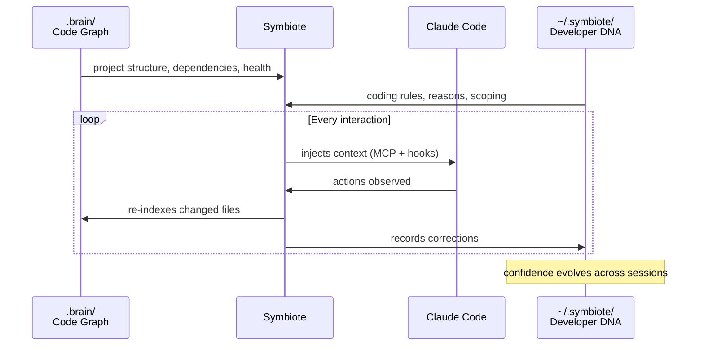
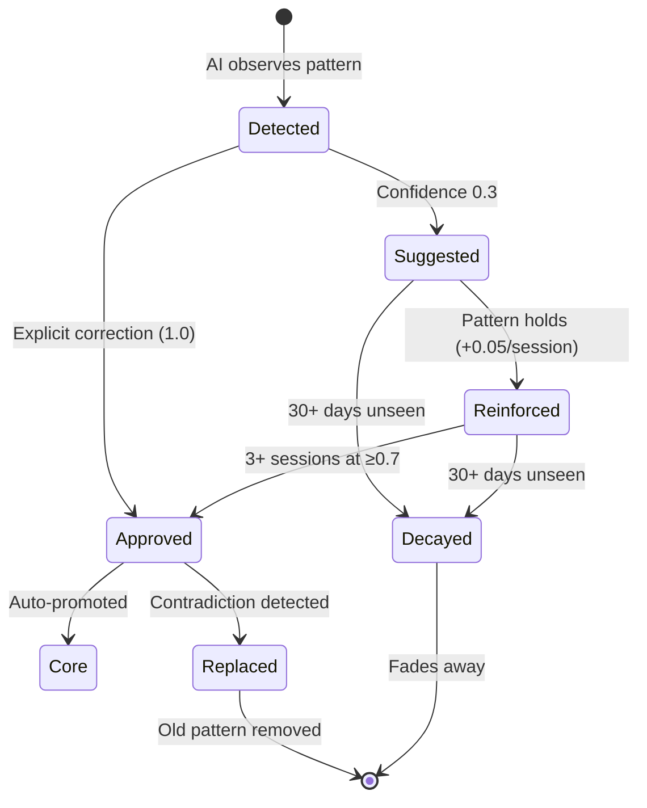
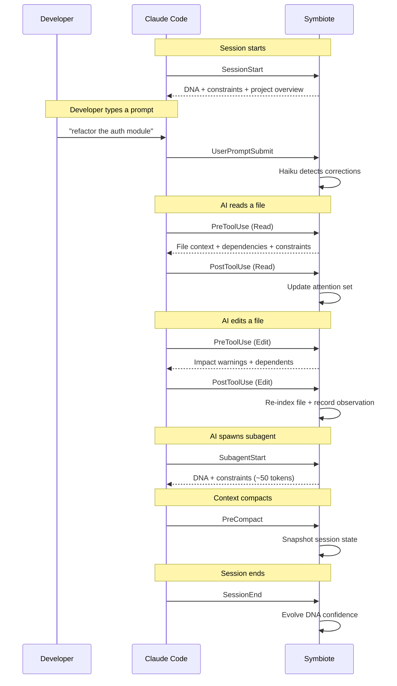

<div align="center">

# Symbiote

**Your AI forgets. Symbiote remembers.**

_Symbiote bonds with your AI tools — giving them memory, context, and your coding DNA._

[](https://www.npmjs.com/package/symbiote-cli)
[](https://github.com/MohmmedAshraf/symbiote/actions/workflows/ci.yml)
[](LICENSE)
[](https://www.typescriptlang.org/)
[](https://modelcontextprotocol.io/)

</div>

---

## The Problem

Every AI coding session starts from scratch. The AI doesn't know your architecture, ignores your conventions, and repeats the same mistakes you corrected yesterday. Static rule files are manual and fragile. Every new conversation is a cold start.

**Your corrections vanish. Your preferences reset. Your AI has amnesia.**

## Why Not Just CLAUDE.md?

CLAUDE.md is great for explicit instructions — but it's static text you maintain by hand. Symbiote is a living knowledge graph that updates itself every time your codebase changes.

|                           | CLAUDE.md                         | Symbiote                                         |
| ------------------------- | --------------------------------- | ------------------------------------------------ |
| **Project structure**     | You write and maintain it         | Auto-scanned, always current                     |
| **Dependencies & impact** | Not possible                      | Full graph — "what breaks if I change this?"     |
| **File connections**      | You document them manually        | Every import, call, and edge mapped              |
| **Coding style**          | You write rules once              | Learns from corrections, carries across projects |
| **Stays current**         | Only if you remember to update it | Re-indexes on every change                       |

They're complementary. Use CLAUDE.md for explicit instructions your AI should always follow. Use Symbiote for the deep project understanding no static file can provide.

---

## Quick Start

### As a Claude Code Plugin

```
/plugin marketplace add MohmmedAshraf/synapse
/plugin install symbiote@symbiote-plugins
```

No setup required — the plugin auto-installs the CLI, registers the MCP server, hooks, skills, and agents.

### Manual Install (all editors)

```bash
npm install -g symbiote-cli
symbiote install
```

Auto-detects your installed editors (Claude Code, Cursor, Windsurf, Copilot, OpenCode), registers the MCP server globally for each, and sets up 9 Claude Code hooks + skills. Run it once.

Then in any project, open Claude Code and run:

```
/symbiote-init
```

This scans your codebase, extracts your coding preferences, project constraints, and architectural decisions — all in one step.

```
Symbiote initialized — scanned 142 files, recorded 18 DNA entries, 5 constraints, 3 decisions.
```

No manual config. No copy-pasting. After the first init, Symbiote's SessionStart hook auto-scans and boots the server on every new Claude Code session — zero cold start.

---

## How It Works

Symbiote has two layers of intelligence that work together: **Developer DNA** (who you are) and the **Project Brain** (what your code is).



### Developer DNA — Your Coding Identity

Lives at `~/.symbiote/profiles/`. Follows you across every project. **Shareable.**

When you correct your AI — _"no, use early returns"_ — Symbiote captures it with the rule, the reason why, and which languages it applies to. Same correction across three sessions? Auto-promoted. Explicit instruction? Approved immediately at full confidence.

Your DNA is a single JSON profile — portable, exportable, switchable:

```bash
symbiote dna              # Active profile summary
symbiote dna export       # Export to .dna.json — share it anywhere
symbiote dna import <file|url>  # Load someone else's DNA
symbiote dna switch <name>      # Swap profiles instantly
```

Import a senior developer's DNA and your AI immediately codes in their style. Switch back to yours anytime. Your DNA is never lost.

### Project Brain — Your Codebase's Nervous System

Lives at `.brain/` in each repo. Auto-generated, optionally enriched.

- **Code graph** — Every function, class, import, and call chain mapped via Tree-sitter
- **Semantic search** — Natural language queries over your codebase (local embeddings, no API)
- **Intent layer** — Architectural decisions and constraints that travel with the repo
- **Health engine** — Dead code, circular deps, coupling hotspots, constraint violations
- **Impact analysis** — "What breaks if I change this?" with confidence-weighted blast radius

---

## DNA Learning System

Corrections don't just get recorded — they evolve. Symbiote tracks confidence across sessions and promotes patterns that hold up over time.



| Path              | How it works                                                                   |
| ----------------- | ------------------------------------------------------------------------------ |
| **Observed**      | Symbiote detects a pattern in your code or corrections                         |
| **Reinforced**    | Same pattern appears across multiple sessions (+0.05 confidence each time)     |
| **Auto-promoted** | After 3+ sessions at ≥0.7 confidence, becomes an approved trait                |
| **Explicit**      | Direct corrections (_"don't use semicolons"_) skip straight to approved at 1.0 |
| **Decayed**       | Patterns unseen for 30+ days gradually fade                                    |
| **Contradicted**  | New correction replaces the old pattern entirely                               |

---

## Session Intelligence

Symbiote hooks into **9 Claude Code lifecycle events** — not just file reads and edits, but session start, user prompts, subagent spawns, compaction, and session end.



The hooks are the key. Your AI doesn't _choose_ to use Symbiote — Symbiote is injected into every interaction. The AI writes better code because it has better context.

Every tool call is observed and correlated with the code graph — not raw text logs, structured graph metadata. Over time, Symbiote learns:

- **Corrections** — detected in real-time via Haiku, recorded with evidence
- **Style patterns** — extracted from what you actually write, not what you say
- **Hotspots** — files edited 3+ times in a session get flagged
- **Failure patterns** — errors correlated with affected symbols across sessions

---

## The Living Brain

```bash
symbiote serve
```

Open the URL printed in your terminal. Your project's brain — a 3D neural graph of your entire codebase. Nodes are files, functions, classes. Edges are calls, imports, dependencies. Color-coded by module cluster. Sized by PageRank importance.

**It reacts in real time.** When your AI reads a file, the node glows. When it edits, the node pulses bright. When it navigates between files, impulses fire along the edges. You're watching your AI think.

| View             | What it shows                                    |
| ---------------- | ------------------------------------------------ |
| **Brain Graph**  | 3D neural visualization — the hero, always alive |
| **Health Pulse** | Code health score (0-100) with actionable issues |
| **DNA Lab**      | Your profiles — rules, reasons, export, switch   |

---

## Editor Support

Symbiote works with any MCP-compatible AI tool. `symbiote install` auto-detects your editors and configures everything.

| Host               | MCP | Hooks (9 events) | Session Intelligence | Real-Time Brain |
| ------------------ | --- | ---------------- | -------------------- | --------------- |
| **Claude Code**    | Yes | Yes              | Yes                  | Yes             |
| **Cursor**         | Yes | —                | —                    | —               |
| **Windsurf**       | Yes | —                | —                    | —               |
| **GitHub Copilot** | Yes | —                | —                    | —               |
| **OpenCode**       | Yes | —                | —                    | —               |

Claude Code gets the deepest integration — 9 hook events cover the full session lifecycle. The brain reacts in real time. Other hosts access Symbiote through MCP tools the AI calls when it needs context.

### Manual Setup

If you prefer to configure manually instead of `symbiote install`:

**Claude Code:**

```bash
claude mcp add symbiote -- npx -y symbiote-cli mcp
```

**Cursor** (`~/.cursor/mcp.json`):

```json
{
    "mcpServers": {
        "symbiote": {
            "command": "npx",
            "args": ["-y", "symbiote-cli", "mcp"]
        }
    }
}
```

**OpenCode** (`~/.config/opencode/.opencode.json`):

```json
{
    "mcpServers": {
        "symbiote": {
            "command": "npx",
            "args": ["-y", "symbiote-cli", "mcp"]
        }
    }
}
```

---

## What Your AI Gets

When bonded, your AI gains 20 tools via MCP:

| Tool                     | Purpose                                                  |
| ------------------------ | -------------------------------------------------------- |
| `get_developer_dna`      | Your style and preferences, filtered by relevance        |
| `get_project_overview`   | Tech stack, structure, modules, health summary           |
| `get_context_for_file`   | Dependencies, dependents, constraints for any file       |
| `get_context_for_symbol` | Full context for a specific symbol                       |
| `query_graph`            | Symbol search, call chains, dependency tracing           |
| `semantic_search`        | Natural language search over the codebase                |
| `get_constraints`        | Active project rules, scoped to file or module           |
| `get_decisions`          | Architectural decisions with rationale                   |
| `get_health`             | Dead code, cycles, coupling, violations                  |
| `get_impact`             | Blast radius analysis with confidence scores             |
| `get_architecture`       | Module boundaries, layering, entry points                |
| `find_patterns`          | Recurring code patterns across the codebase              |
| `detect_changes`         | Git diff mapped to affected graph nodes                  |
| `rename_symbol`          | Graph-aware multi-file rename preview                    |
| `trace_flow`             | Follow execution from entry points through call chains   |
| `trace_data`             | Track how data moves through the codebase from a symbol  |
| `find_implementations`   | Find all classes implementing an interface or base class |
| `propose_decision`       | AI writes back a discovered decision                     |
| `propose_constraint`     | AI writes back an inferred constraint                    |
| `record_instruction`     | Captures your corrections for DNA learning               |

Plus 3 MCP resources: `symbiote://dna`, `symbiote://project/overview`, `symbiote://project/health`

---

## Project Health

```bash
symbiote impact   # What breaks from your uncommitted changes?
```

The health engine scores your project 0-100 across four dimensions:

| Dimension             | Weight | What it catches                             |
| --------------------- | ------ | ------------------------------------------- |
| Constraint violations | 40%    | Your own rules being broken                 |
| Circular dependencies | 20%    | Modules that shouldn't depend on each other |
| Dead code             | 20%    | Unused exports, orphan files                |
| Coupling hotspots     | 20%    | Files that change together too often        |

Every issue links to a file and line number. The Health Pulse view in the web UI makes them actionable.

---

## What Gets Created

```
~/.symbiote/                 # Global — your coding identity
├── config.json              # { "active_profile": "personal" }
└── profiles/
    ├── personal.json        # Your DNA — always exists
    ├── theprime.json        # Imported from someone else
    └── kent-react.json      # Another imported profile

your-project/.brain/         # Per-project — the brain
├── symbiote.db              # Code graph + embeddings (gitignored)
└── intent/                  # Committed to git — shared with team
    ├── overview.md          # AI-generated project summary
    ├── decisions/           # "Why we chose X over Y"
    └── constraints/         # "No raw SQL in application code"
```

Each DNA profile is a single `.dna.json` file containing rich entries — rule, reason, category, language scoping, and evidence. Export yours, share it on Twitter, import someone else's with one command.

The intent layer is committed to git. New team member runs `/symbiote-init` — they get the full project brain plus their personal DNA on top. Same project understanding, individual style.

---

## Language Support

Symbiote uses Tree-sitter for precise code parsing. **Bundled** languages ship with the package and have dedicated extraction patterns. **On-demand** languages are downloaded on first encounter and use generic AST traversal.

| Language   | Functions | Classes | Methods | Imports | Calls | Types | Enums |
| ---------- | --------- | ------- | ------- | ------- | ----- | ----- | ----- |
| TypeScript | ✓         | ✓       | ✓       | ✓       | ✓     | ✓     | ✓     |
| JavaScript | ✓         | ✓       | ✓       | ✓       | ✓     | —     | —     |
| TSX        | ✓         | ✓       | ✓       | ✓       | ✓     | ✓     | ✓     |
| Python     | ✓         | ✓       | ✓       | ✓       | ✓     | —     | —     |
| Go         | ✓         | ✓       | ✓       | ✓       | ✓     | ✓     | —     |
| Rust       | ✓         | ✓       | ✓       | ✓       | ✓     | ✓     | ✓     |
| Java       | ✓         | ✓       | ✓       | ✓       | ✓     | ✓     | ✓     |
| C          | ✓         | ✓       | —       | ✓       | ✓     | ✓     | ✓     |
| C++        | ✓         | ✓       | ✓       | ✓       | ✓     | ✓     | ✓     |
| Ruby       | ✓         | ✓       | ✓       | ✓       | ✓     | —     | —     |
| PHP        | ✓         | ✓       | ✓       | ✓       | ✓     | —     | —     |

> **Any other language** with a Tree-sitter grammar also works — downloaded and cached at `~/.symbiote/grammars/` on first encounter. Functions and classes are extracted via generic traversal; deeper features depend on language-specific patterns.

---

## CLI Reference

| Command                      | What it does                                   |
| ---------------------------- | ---------------------------------------------- |
| `symbiote install`           | One-time global setup for all detected editors |
| `symbiote scan`              | Rescan codebase (incremental)                  |
| `symbiote scan --force`      | Full rescan, ignore cache                      |
| `symbiote serve`             | MCP server + web UI (port auto-assigned)       |
| `symbiote mcp`               | MCP server only (stdio, for editors)           |
| `symbiote dna`               | Active profile summary                         |
| `symbiote dna list`          | List all DNA profiles                          |
| `symbiote dna switch <name>` | Switch active profile                          |
| `symbiote dna export`        | Export profile to `.dna.json`                  |
| `symbiote dna import <file>` | Import a shared profile                        |
| `symbiote dna diff <name>`   | Compare two profiles                           |
| `symbiote impact`            | Analyze impact of working changes              |
| `symbiote unbond`            | Detach from all AI hosts                       |

---

## Tech Stack

| Layer          | Technology                                                   |
| -------------- | ------------------------------------------------------------ |
| **Language**   | TypeScript (strict mode)                                     |
| **Monorepo**   | Turborepo (packages/cli + packages/web)                      |
| **Parsing**    | Tree-sitter (11 bundled languages)                           |
| **Database**   | DuckDB + sqlite-vec (graph storage + vector search)          |
| **MCP**        | @modelcontextprotocol/sdk (stdio + HTTP)                     |
| **Embeddings** | Transformers.js (local, all-MiniLM-L6-v2)                    |
| **Graph**      | Graphology (Louvain, PageRank, betweenness)                  |
| **Web UI**     | Vite + React 19 + react-three-fiber + Three.js + custom GLSL |
| **Styling**    | Tailwind CSS v4 (dark theme)                                 |
| **Testing**    | Vitest (800+ tests)                                          |

---

## Privacy

Everything runs locally. No data leaves your machine. No external API calls for core features. The code graph, embeddings, DNA, session observations, and health analysis all run on your hardware. Observations store graph metadata only (which tool, which file, which symbols) — never file contents or command outputs.

---

## License

[MIT](LICENSE)
